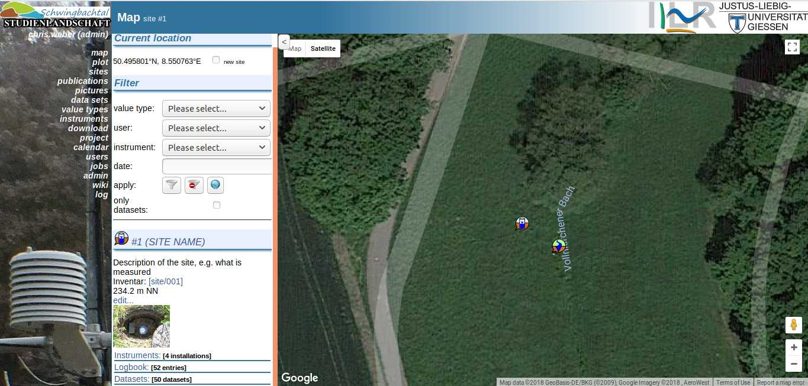
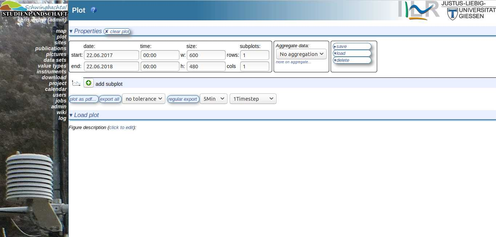
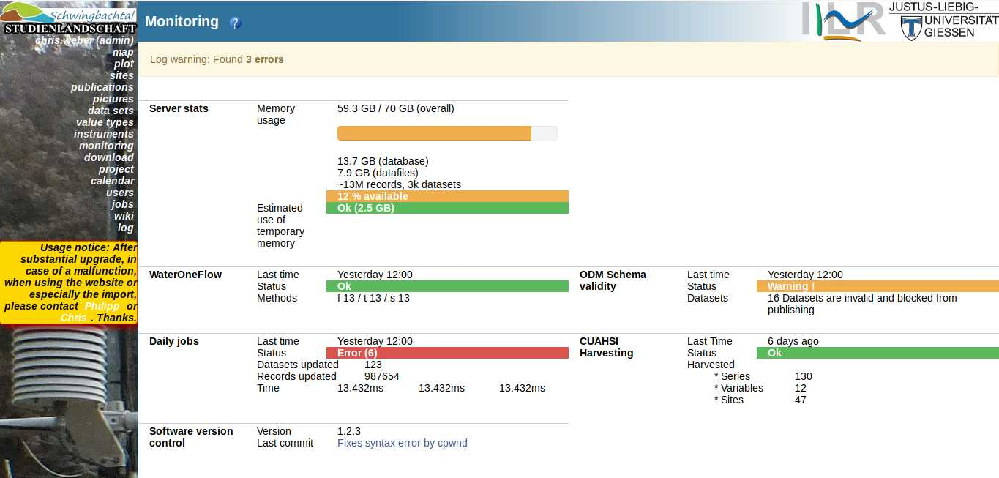

# Views

This section describes the different views of the web interface

## Map
Accessible via `/map`

In this view a user can browse the installations of field instruments, which are called sites.
Or the user can create new sites. Sites are meta data, which can be attached to measurement data.
The sites are integrated into a large Google Map element on the right.
There is the opportunity to filter the displayed sites.

## Plot
Accessible via `/plot`

The user is able to display or download measurement data in an customizable fashion. A once configured
 plot can be saved for future use.

#### The configuration of a plot image
In this paragraph, the configuration of a plot image is described in depth.

TBD.

## Sites
Accessible via `/site`

This pages gives insight to the locations in the field, where measurements are made.
For e.g. there are all datasets listed, which are measured and later online registered at this location.

## Publications
Accessible via `/publications`

The content of this page can be configured at run time via a browser editor. It can be used to be a list of all
publications of interest for this site. Just click the "edit" button above and save
your changes afterwards. At this point the page is empty. A example of such a page can be found [here](#)

## Data sets
Accessible via `/dataset`

On this view, the user can get information about datasets, such as at which site the measurement was made,
what the date time range of the records are or who uploaded the dataset. See the [schema definition](development.html#dataset) of
datasets database model for a complete list of available informations.

Via the `goto`-button its possible to jump to a any dataset by its number.

## Value Types
Accessible via `/valuetype`

On this page a user can access information of all registered valuetypes of the page.
On the right the user can inspect a list of all instrument in alphabetical order and
navigate with a click between them.
Also its possible to add valuetypes via the `new entry` button on top on the right side.
See the [schema definition](development.html#valuetype) of valuetypes database model for a complete list of available informations.

## Instruments
Accessible via `instrument`

When visiting this page a user can access information about the instruments used
in the field. On the right the user can inspect a list of all instruments in alphabetical order.

## Download
Accessible via `/download`

On this page a user can manage files that preferably include measurement data.
Files can be uploaded via the form above, to be saved permanently on the server.
The interface is similar to a file browser. There are files and directories.
By clicking on a directory, the browser opens a new view by listing all files in this folder.
The special case of click on a file, triggers the import process. Briefly the import process
checks if a `*.conf` file present in the current or a parent directory. Depending on the
existence of such a config file and the file ending of the chosen file, the process enters
one of three import process branches. The import process is describe in more detail
in the [development chapter](development.html#import-process).

## Project
Accessible via `/project`

A project corresponds to none or multiple datasets, which are under the sphere of responsibility of this project. This
can be used to organize all datasets, e.g. in there institute projects or depending on there funding initiaitives. For
more infos see the [schema model](development.html#odmf-schema-model).

The description text is published via the CUAHSI WaterOneFlow interface, for each time series.

## Calendar
Accessible via `/calendar`

In this view a user can have a eye on all tasks and their due date. The tasks are linked to their respective jobs.
For example the calendar can be used to keep track of measurement jobs, which then are done by people that are registered as users of the database.

## Users
Accessible via `/person`

On this page the user can examine a list of all registered users
and information about them, such as their role or access level, phone number and so on.

Also administrative functionalities, such as change a password or marking a user as inactive (only as administrator) can be done via this page.

## Jobs
Accessible via `/job`

At this view tasks can be created. Most importantly a task has a due date, description and an assigned user.
Task will be displayed in the [calendar](views.html#calendar) view.
For more information see the [database model](development.html#job) of a job.

## Wiki
Accessible via `/wiki`

Here the user can maintain a project-specific wiki page, where information only regarding the project has its place.
For example ...

This the content of the wiki can also be edited, created and deleted via a similar button menu on top of the page as
on the [publications page](#publications).

## Log
Accessible via `/log`

TBD.

## Admin
Accesible via `/admin`

This is the monitoring view, which displays metrics regarding the server platform, for example
the Postgres database, hardware stats and eventually the HydroServerLite
instance. The view is only Accessible for a user with admin privileges.

The view gives information about
1. stats on the local hard drive
2. Status of Version Control System via Git

Additionally if configured:
3. Validity of the Schwingbach => ODM [schema mapping](development.html#schema-mapping-validity)
4. Accessability of the WaterOneFlow Service
5. Status of daily jobs, such as the [Transformed Timeseries](development.html#daily-jobs)
6. Status of the harvesting done by cuahsi
